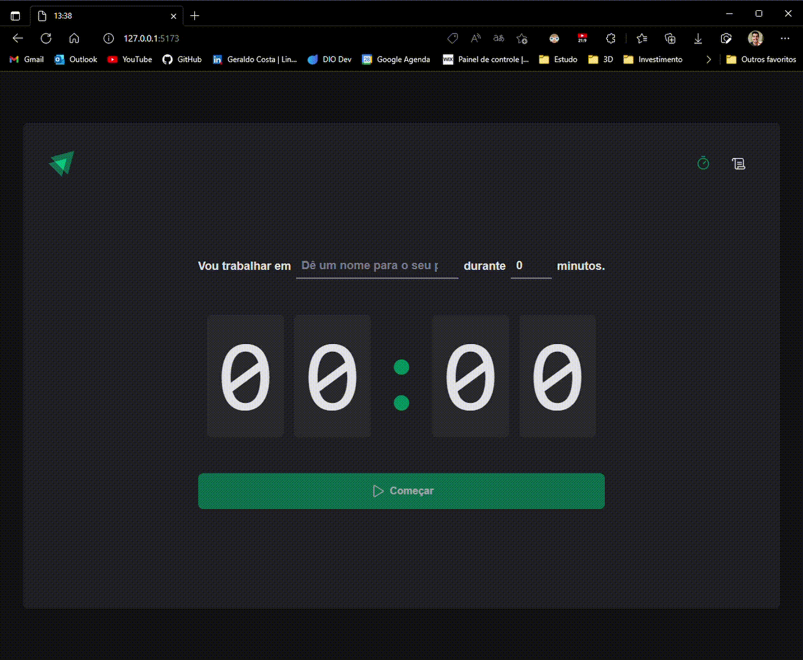
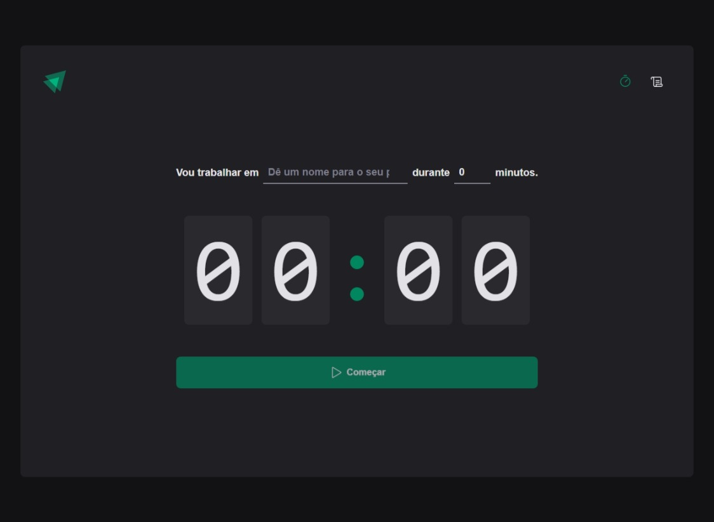
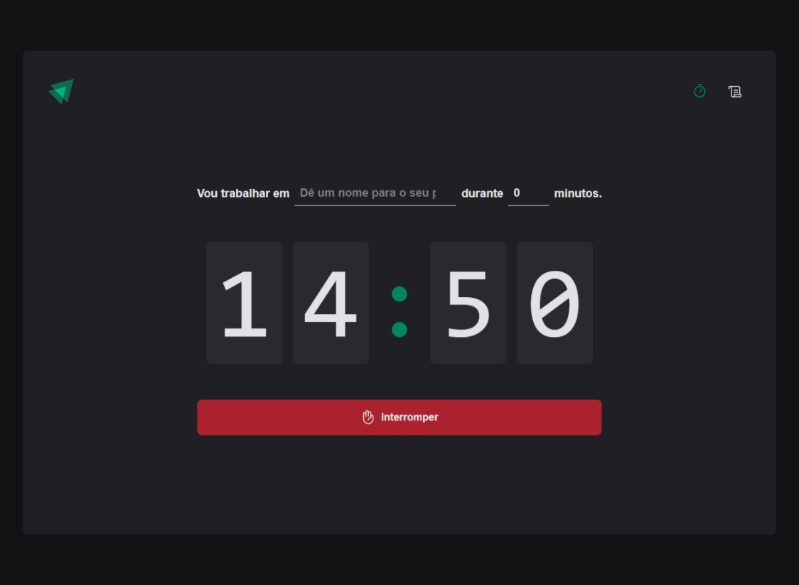
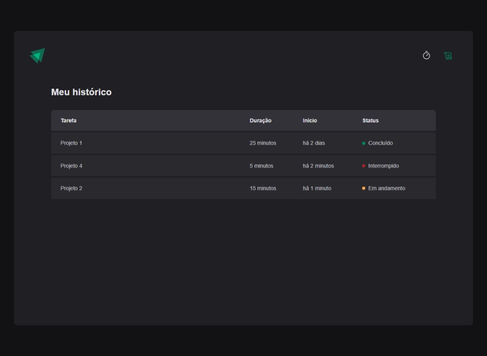

# ⏲️ Ignite Timer

## Este projeto foi desenvolvido durante o curso Ignite da Rocketseat, utilizando React.js, TypeScript e o Vite como plataforma de desenvolvimento. Com o objetivo de fornecer uma eficiente ferramenta de gestão de tempo baseada no método Pomodoro, ele possui duas telas: uma para cronometrar


### Tecnologias utilizadas durante desenvolvimento
- Vite
- React.js
    - Context API
    - useReducer
- Hook Form
- Zod
- Styled-Components
- Typescript
- Phophor-react
- Immer
- Date Fns

<div align="center" style="display: inline_block"><br>
  
  
  
  
  
  
  
</div>
<br>

<hr>






# Install

Clone this repository and install it dependencies with this command:
```sh
$ npm install
```
Run the application with npm run dev command, it will start the app:
```sh
$ npm run dev
```

